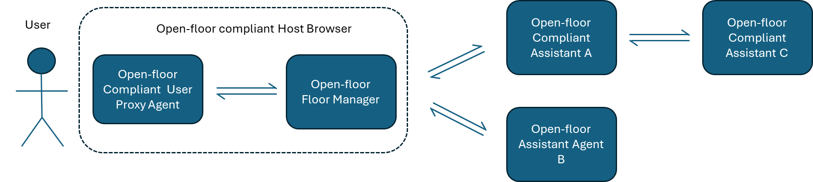
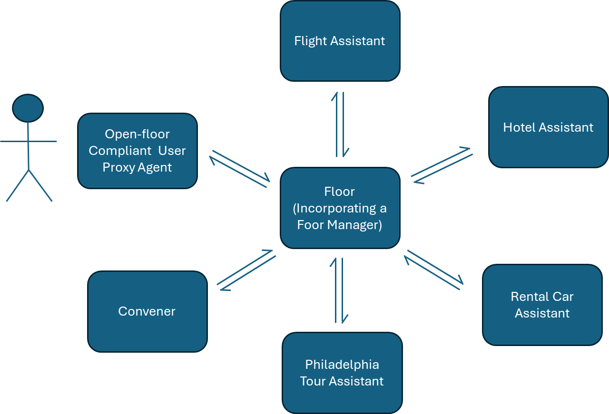

# Open-Floor Inter-Agent Message Specification Version 0.9.4

The Open Floor Project\
Open Voice Interoperability Initiative - LF AI & Data Foundation

May 6th 2025
Version 0.9.4
Status: Issued

*_Editor-in-Chief: David Attwater_*\
*_Contributors: Leah Barnes, Emmett Coin,  Deborah Dahl, Diego Gosmar, Jim Larson, Rainer Türner, Dirk Schnelle-Walka, Allan Wylie_*

## TABLE OF CONTENTS
### CHAPTER 0. SCOPE AND INTRODUCTION
#### &nbsp; 0.1 Document Scope
#### &nbsp; 0.2 Open Floor Message Envelopes
#### &nbsp; 0.3 Delegation, Channeling and Mediation
#### &nbsp; 0.4 Multi-Party Conversations
#### &nbsp; 0.5 Discovery
#### &nbsp; 0.5 Agent Identity
### CHAPTER 1. SPECIFICATION
#### &nbsp; 1.1 Syntax and Protocol
#### &nbsp; 1.2 AAA & Security
#### &nbsp; 1.3 Nomenclature
#### &nbsp; 1.4 Message Envelope Structure
#### &nbsp; 1.5 Schema Object
#### &nbsp; 1.6 Conversation Object
#### &nbsp; 1.7 Sender Object
#### &nbsp; 1.8 Events Object
#### &nbsp; 1.9 Event-Types
#### &nbsp; 1.10 Utterance Events
##### &nbsp; &nbsp; &nbsp;  1.10.1 Utterance Text Feature
#### 1.11 Extensible Dialog Event Features (Informative)
#### 1.12 context Event
#### 1.13 invite Event
#### 1.14 uninvite Event
#### 1.15 declineInvite Event
#### 1.16 bye Event
#### 1.17 getManifests Event
#### 1.18 publishManifests Event
#### 1.19 requestFloor Event
#### 1.20 grantFloor Event
#### 1.21 revokeFloor Event
#### 1.22 yieldFloor Event

### CHAPTER 2. MINIMAL BEHAVIORS
#### &nbsp; 2.1 Minimal Assistant Behavior
#### &nbsp; 2.2 Minimal Conversation Floor Manager Behaviors
#### &nbsp; 2.3 Ignoring events with protocols such as HTTP POST
### CHAPTER 3. JSON Envelope SCHEMA
### CHAPTER 4. REFERENCES
### CHAPTER 5. GLOSSARY OF TERMS
### CHAPTER 6. DECISION LOG
### CHAPTER 7. DOCUMENT CHANGE LOG

*****
### CHAPTER 0. SCOPE AND INTRODUCTION
#### 0.1 Document Scope
This document specifies the "Open-Floor" Inter-Agent Message Specification, developed by the Open Voice Interoperability Initiative operating within the Linux Foundation AI & Data Foundation.  The purpose of this open messaging standard is to enable human and autonomous agents to work together by gathering around a shared conversational 'floor' and engage in conversation to solve a shared problem or goal.

The standard differs from other inter-agent frameworks in the following ways:

- Uses multi-party conversation as the model for inter-agent co-operation
- Open standard that can allow inter-working between agents in different technology stacks
- Symmetry between Users and Agents allowing humans and AIs to collaborate to solve problems
- Extensible to new media types 

The user stories upon which this specification is based can be found in the white paper - Interoperability of Conversational Assistants [1].  

#### 0.2 Open-Floor Message Envelopes
The Open-Floor Message format is a universal JSON structure whose purpose is to allow human or automatic agents (assistants) to interoperably participate in a conversation.  When coupled with a specific protocol, such as HTTPS (See section 1.2), a conversational agent that can generate and send Message Envelopes is capable of inter-operating with any other Open-Floor compliant agent, regardless of the technology or architecture on which that other agent is based.

Collaboration between agents and human users is modelled upon a conversation between peers gathering around a shared 'floor'.  As with normal human-human conversation, agents (users or conversational assistants) communicate with each other by exchanging 'utterances'.  In many ways the 'floor' is analogous to a  conference bridge that joins participants in a conversation.  Also, as with normal conversation, the participants in the conversation collaborate to achieve a goal together. In some cases a convener agent may also be present to mediate the conversation on the floor in a manner analogous to a chair moderating a meeting.

A conversation can consist of multiple conversants, who may be any arbitrary mixture of human or autonomous agents.  The simplicity of the interface means that the messages can also be used as a platform independent interface between a chat client and AI chat agents.

Figure 1 shows a simple schematic showing a user interacting at various points with three Open-floor compliant dialog assistants, via a user proxy agent, and a conversation floor manager.  Let's assume for now that there is a single user who remains constant for the duration of the conversation.  This user engages with a number of dialog agents, one at a time,  during the course of the conversation in a sequential manner.

The proxy agent acts as a media gateway with the user - converting whatever media interface the user is interacting with into standard interoperable messaging. The conversational floor manager acts as a hub to coordinate the conversation.

In the example shown in Figure 1, the user proxy agent and the conversation manager can be combined.   This combined function is termed an 'Open-Floor Compliant Host Browser'.

In its simplest form, the user proxy agent might present a text-based chat interface to the user.  For spoken interaction, the proxy agent will likely also contain speech-to-text and text-to-speech facilities but other configurations are also anticipated including support for images, video and document attachments.  The proxy agent may have conversational ability in its own right but in many cases, it may only provide rudimentary capabilities such as wake-word detection.

Messages that pass between Open-floor agents are termed 'conversation envelopes'.  Each arrow in the diagram denotes a message passing from one agent to another.  Each of these messages will comprise a single message envelope.   Each conversant can 'hear' things said to it or 'say' things by making an 'utterance'.   They can also 'whisper' to each other behind the scenes by sending private utterances to each other.   Conversants may also invite other agents to join the conversation or they might ask other agents if they are capable of a certain activity or would like recommend another agent for a certain task.

#### 0.3 Delegation, Channeling and Mediation

The floor manager is in control of which conversants are engaged in a conversation at any given moment.

To start a conversation, the proxy agent invites a specific dialog agent (e.g. Dialog Assistant A) to take part in a conversation with the user.   Once engaged, the assistantt receives an open-floor message containing a user utterance and sends an utterance back to the user in response.  Once the assistant is done with the interaction they can simply end the interaction or, via the floor, invite another agent to enter the conversation (e.g. Dialogue Assistant B in the diagram).   The change of control of a dialog between two agents is called 'delegation'.

Dialog Assistants may also engage the services of another dialog assistant behind the scenes to assist with the conversation (e.g. Assistant A engages the services of assistant C to support it in its interaction with the user.)    The controlling agent might choose to pass utterances unaltered to the target agent and may in return pass the target agent's responses unaltered to the user.  This pattern is termed 'channeling'. It is in many ways functionally equivalent to delegating the conversation but the channeling agent passes the messages on or can intervene or override the contribution of the agent to which the conversation is being channeled.  For example, a channelling agent may decide to keep the intent of the utterance but change how the content is rendered.  In a voice interface this might involve things like increasing the volume for the hard of hearing, decreasing the speed of presentation for the cognitively challenged or for non-native speakers, change the voice characteristics of the presentation, or change the language, or change visual characteristics if these are present.

Alternatively, the intermediate agent may reformulate the user's utterances and/or the target agent's utterances, holding whole conversations behind the scenes in order to achieve a goal.  This pattern is termed 'mediation'.  The mediation pattern also may be particularly relevant in the case where the target agent is in fact another human user (e.g. where an autonomous agent acts on behalf of a user to book an appointment with a doctor or restaurant).

There is no limit to the depth of a channeling or mediation chain and delegation can happen at any level in such a chain.  Any agent that is hosting a mediated or channeled conversation will act as the conversation floor manager to those agents it is hosting.

The patterns described above allow for conversation between one user and multiple agents where it is clear which agent has the conversational floor at any given moment.  As noted the channeling and mediation pattern do allow for more than one conversational agent to be involved in the conversation at the same time.

### 0.4 Multi-Party Conversations

\
**Figure 2.  Multi-party conversations hosted by a floor manager and a converner agent.**\
\
This specification also contains extensions to support the implementation of simultaneous multi-party conversation where multiple users and agents may be listening to the conversation simultaneously and take turns to speak or even speak over one another. Figure 2 shows how this might work.  It extends Figure 1 to show multiple agents taking part in a conversations simultaneously.  As in Figure 1, the floor manager manages the conversational interaction.  In a multi-party conversation the floor will optionally invite a 'Convener' agent to the conversation. This will be a compliant agent but with special privileges.  Message envelopes that are sent to the floor by an agent are copied to all members present in the current conversation (with the exception of certain private messages discussed later).   

The convener manages which agent has the floor at any given moment via the floor manager.  An in depth description of this approach can be found in [7].  Support for multi-party conversations is still somewhat experimental. Additional features or small changes may be necessary as the use-cases and patterns for this becomes more mature.

The multi-party conversation paradigm is also promising to give a framework-free agentic framework where autonomous AI agents collaborate using a shared floor to achieve a goal.   

### 0.5 Discovery

Agents can ask other agents if they are able to satisfy a certain enquiry or whether they can recommend another agent for the task.  This pattern is called 'discovery'.  The initiating agent asks another agent to 'find' an assistant and includes details of the task to this agent.  The recipient can then respond by:

- Proposing themself for the task (i.e. 'accept' the request to do a task)
- Proposing one or more agents for the task with a rating (i.e. act as a discovery agent)
- Proposing one or more agents to help 'find' an agent for the task (i.e. recommend another discovery agent)
- Proposing no agents (i.e. the agent cannot do the task or recommend any other agent)

The requesting agent can then choose to invite the proposed agent to the conversation, or simply speak directly to the proposed agent if they are already party to the conversation.

This feature can also be used to ask an agent for a manifest of its own capabilities.

By combining this discovery mechanism with the delegation and channelling patterns mentioned above rich patterns of agent interaction can emerge. Some agents can specialize as 'discovery agents' whose only role is to provide recommendations of other agents. This provides the conversational equivalent of a web search.  Agents can also recommend themselves for some enquiries and recommend other agents for others. This allows, for example, for a primary assistant to perform day to day tasks and recommend other agents for less common tasks. Agents can ask one or more agents to assist with this search who in turn can ask other agents.   Planning agents may propose steps to be taken in achieving a plan and then an orchestrating agent can then discover and invite agents to achieve parts of the plan.

## 0.6 Agent Identity

Agents and human conversants in a conversation need to be able to identify and recongnize each other during a conversation.  Conversants in this standard are located and identified by two parameters:

- **serviceUrl** - The URL of the server that hosts the agent.  
- **speakerUri** - A unique string that uniquely identifies the agent in URI syntax. 

Let's use an analogy to illustrate the difference between the two.   The _serviceUrl_ could be analogous to the exact address that can be used to locate the agent and the _speakerUri_ identifies the specific agent at that address.

The **serviceUrl** should point to an end-point that is capable of consuming and generating Open-floor message envelopes.

Agents or human conversants are free to choose any valid URI to identify themselves.  speakerUri's should be unique and ideally remain persistent for the whole lifetime of the agent or user.  Ideally, the speakerUri should be a URN [5] but any valid URI can be used.  The purpose of this URI is to provide a persistent unique key to the identity of the agent.  It is not a requirement that this URI be resolvable to an actual location on the internet.  The _serviceUrl_ is used for this purpose.

Examples of valid speakerURI are given below.

- **tag:sandro@w3.org,2004:Sandro**: A Tag URI as per [6]
- **urn:isbn:978-3-16-148410-0**:  A URN as per [5]. The isbn scheme is used for books.
- **mailto:info@example.com**: A URI that specifies an email address asociated with an agent
- **tel:+1-212-555-1212**: A URI that specifies a phone number associated with an agent
- **https://openfloor.myopenflooragent.com/agent#3456**: A URI using an http address that could be the same as the agent serviceserviceUrl.

NOTE: This standard is currently agnostic regarding the URI scheme used for an agent. Options for standardizing further might include the regisstration of a specific URN namespace identifier, for example, 'urn:openFloor' [5].  In the short term Tag URIs [6] represent a pragmatic way to generate a unique idenfifier for an agent.  In this document we use Tag URIs in all examples.

### CHAPTER 1. SPECIFICATION

#### 1.1 Syntax and Protocol

A conversation envelope will be represented as a JSON [1] object in a string format.  The JSON conversation envelope is expected to be a stand-alone document or object but there is no reason that it cannot be part of a larger JSON document.

JSON was chosen for the Open Floor conversation envelope as it is an Open and Human Readable Standard format for Data Exchange that is independent of any particular protocol.  Supported protocols and the mechanisms by which two agents agree on a protocol to be used are currently outside the scope of this document.\
\
For the sake of simplicity, it is anticipated that Open Floor implementations will initially use HTTPS as underlying communication protocol, but could include several other ones currently available (i.e. SIP, Websockets, WebRTC, etc) or any future available ones (i.e, HTTP/3, etc).

#### 1.2 AAA & Security

Authorization, Authentication, Accounting, and Security specifications are outside the scope of this document and will be defined in separate documents. 

#### 1.3 Nomenclature

This specification uses ‘camelCase’ (i.e. no spaces with new words being capitalized) for all nominal property names, for example, _eventType_ and _persistentState_.  

#### 1.4 Message Envelope Structure

    {
      "openFloor": {

          "schema": {
              "version": "0.9.4",      
              "serviceUrl": "https://github.com/open-voice-interoperability/docs/tree/main/schemas/conversation-envelope/0.9.4/conversation-envelope-schema.json"
          },

          "conversation": {
              "id": "31050879662407560061859425913208",
              "conversants": [
                  {partial manifest speaker 1}
                  ...
                  {partial manifest speaker N}
              ]
          },
    
          "sender": {
            "serviceUrl": "https://example.com/message-from"
          },
    
          "events": [
              {
                  "to": {
                      "serviceUrl": "URL of intended recipient A",
                      "speakerUri": "Speaker Uri of intended recipient A"
                  },
                  "eventType": "event type A",
                  "parameters": {
                    "parameter 1" : { parameter 1 values },  
                    … 
                    "parameter n" : { parameter n values }  
                  }
              },
              {
                  "to": {
                      "serviceUrl": "URL of intended recipient B",
                      "speakerUri": "Speaker Uri of intended recipient B"
                  },
                  "eventType": "event type B",
                  "parameters": {
                    "parameter 1" : { parameter 1 values },
                    … 
                    "parameter n" : { parameter n values }   
                  }
              }
          ]
      }
    }

##### Figure 3. An example of a conversation envelope #####

Figure 3 shows an example of a conversation envelope.  The envelope is wrapped in an 'openFloor' key.   This contains four sections:

* schema - the version of the conversation envelope and a schema to validate it against
* conversation - persistent information related to the current dialog
* sender - details of the sender of the envelope
* events - a list of Open Floor 'events'

All sections are mandatory.

#### 1.5 Schema Object

    {
      "openFloor": {
        ..
        "schema": { "version": "0.9.4" }
        ..
      }
    }

##### Figure 4. Mandatory elements of the _schema_ object.

The _schema_ object specifies the format of the message in this Open Floor envelope.  It is mandatory. It must contain a valid _version_ number for an Open Floor envelope.  Figure 4 shows the minimal information that must be present in an Open Floor-compliant envelope.

    {
      "openFloor": {
        ..
        "schema": {
          "version": "0.9.4",   
          "serviceUrl": "https://github.com/open-voice-interoperability/docs/tree/main/schemas/conversation-envelope/0.9.4/conversation-envelope-schema.json"
        }
        ..
      }
    }

##### Figure 5. Other optional elements in the _schema_ object.

The schema for the version of the envelope specification can be found in **Chapter 3. Schema**.  Figure 5 shows an optional _serviceUrl_ that may also be included which should point to the correct version of that JSON schema.

#### 1.6 Conversation Object

    {
      "openFloor": {
        …        
        "conversation": { "id": "jk31050879662407560061859425913208" },
        … 
      }
    }

##### Figure 6. Mandatory elements of the _conversation_ object.

The conversation object carries persistent information related to the current conversation.  It should be passed on from agent to agent.

As shown in Figure 6, the conversation section contains just one piece of mandatory information - the id of the conversation.  The id  should be a unique identifier for the current conversation with the user.  Persistent information relating to this current conversation can be keyed to this id.   The id  can be any arbitrary length character sequence that can be represented as a string in JSON.

    {
      "openFloor": {
        …        
        "conversation": { 
          "id": "jk31050879662407560061859425913208",

          "conversants" :[
              {      
                "identification":
                  {
                      "speakerUri" : "tag:dev.buerokratt.ee,2025:0001",
                      "serviceUrl": "https://dev.buerokratt.ee/openfloor/conversation",
                      "organization": "Government of Estonia",
                      "conversationalName": "Buerokratt",
                      "department": "Passport Office",
                      "role": "Immigration Specialist",
                      "synopsis": "Immigration specialist as part of the Beurocrat system."
                  },
                  "persistentState": {
                    "uniqueKey1": { .. object .. },
                    "uniqueKey2": { .. object .. } 
                  }
              }
          ]
        },
        … 
      }
    }

##### Figure 7. Optional elements in the _conversation_ object.

Figure 7 shows other additional elements in the conversation object. 

The _conversants_ section is optional and if present should contain a list of all the conversants in the conversation and be persisted by participants in the conversation.  Each conversant object should contain an _identification_ key and an optional _persistentState_ key. 

The _identification_ section should be a copy of the _identification_ section of the agent's manifest as defined in [4].   

The _persistentState_ is optional and consists of key-value pairs where the values can be any arbitrary JSON object.  The purpose of this is to enable agents to persist information that is important to maintaining internal state in the conversation.  Message senders should only add new key-value pairs to their own conversant object.

All message handlers should persist the data in this section when replying to a message.  Agents are encouraged to remove themselves from the _conversant_ section when sending a 'bye' event.  It is incumbent on floor managers to also do basic housekeeping on the _conversation_ section.

There are currently no restrictions currently placed on the content of persistent objects.   Privacy and security issues apply here. It is suggested that the data in these sections is encrypted but this is not mandatory.  Consideration should also be given to the size of any objects in this section as this might affect the downstream performance of the remaining conversation.

#### 1.7 Sender Object

    {
      "openFloor": {
        …        
        "sender": {
            "speakerUri" : "tag:acmeConvenerAssistant.com,2025:0021",
            "serviceUrl": "https://acmeConvenerAssistant.com",
        },
        … 
      }
    }

##### Figure 8. Elements of the _sender_ object. 

Figure 8 shows the elements in the sender object.  _speakerUri_ is mandatory. The _serviceUrl_ is optional. It is good practice to include it if there is no _conversant_ section or the protocol being used to transport the envelopes does not carry source and destination address information.   

#### 1.8 Events Object

    {
      "openFloor" {
        ..
        "events": [
          {
            "to": {
                "speakerUri": "Speaker Uri of intended recipient A",
                "serviceUrl": "URL of intended recipient A",
                "private": false
            },
            "eventType": "event type A",
            "reason": "reason for sending event A",
            "parameters": {
              "parameter 1" : { parameter 1 values },  
              … 
              "parameter n" : { parameter n values } 
            }
          },
          {
            "to": {
                "serviceUrl": "URL of intended recipient A",
                "speakerUri": "Speaker Uri of intended recipient A"
            },
            "eventType": "event type B",
            "reason": "reason for sending event B",
            "parameters": {
              "parameter 1" : { parameter 1 values },
              … 
              "parameter n" : { parameter n values }   
            }
          }
        ]
      }
    }

##### Figure 9. The _events_ object

Figure 9 shows the structure of the _events_ object.  This should be an array of one or more objects which we will call an event object. 

Each event object must have an _eventType_, which is a string.  Other parameters may be present depending on the eventType. The _parameters_ object is a dictionary of parameter objects with standard key names specific to the event-type.  Some eventTypes support a 'bare' mode without any parameters. 

The optional _to_ section contains two parameters. The first is a _speakerUri_ of the target recipient.  The second is the _serviceUrl_ which is a valid URL of the assistant that the message is intended for.   The _to_ section is optional. If it is present then it must contain a _ServiceUrl_ or a _speakerUri_ or both.  If the _to_ section is not present then is can be assumed that the event is intended for all recipients of the envelope.  

The _to_ section also contains a _private_ boolean parameter which, when set to true, indicates that the event is only intended for the _to_ agent alone.  If true then the event should not be copied by any intermediary agent to any other agents in a multi-participant conversation.  If it is not defined it is assumed to be _false_ i.e. any message intended for another recipient can be copied to other participants in the conversation for context. If there is not a _to_ section then the event is by default assumed to be public.

        "events ": [
          ...
          
          {
            "eventType":""revokeFloor",
            "to": {
              "speakerUri":"tag:agentBeingRevoked,2025:1234"
            },
            "reason" : "convener agent taking back the floor because @timedOut"
          }

          ...
        ]

##### Figure 10. Example of "reason" section containing a special token @timedOut.

The optional _reason_ section is a string which can be used to convey the reason that the event is being sent.  This text can contain natural language in any language but by convention special tokens can be included which have special meaning for the event.   These are prefaced by an '@' sign, for example, '@timedOut'.  Special tokens cannot contain anything that could be considered to be a word break such as white space or punctuation. For clarity, a special token is defined as any substring in the _reason_ text that matches the  regular expression: `@[a-zA-Z0-9_]+`

Figure 10 shows an example of this.

#### 1.9 Event-Types

The following are valid values for _eventTypes_.

* **speaking or sending multi-media events** (publicly or privately)
  * _utterance_  - An 'utterance' spoken or whispered from one conversant to some or all participants
  * _context_ - Optional additional text or media to accompany an utterance.

* **joining or leaving conversations**
  * _invite_ - A conversant is invited to join the conversation.
  * _uninvite_ - A conversant is removed from the conversation.
  * _bye_ -  A conversant is leaving the conversation

* **discovering other agents and establishing their capabilities**
  * _describeAssistant_ - Ask an agent to return a list of manifests of their own capabilities.
  * _publishManifests_ - Return a list of manifests for the current assistant.
  * _getManifests_ - Ask an agent to recommend themself or another agent for a task.
  * _publishManifests_ - Return a list of recommended agents for a task.

* **managing who has the conversational floor** (support for multi-party conversations and floor passing between agents)
  * _requestFloor_ - Used by a conversant to request the floor.
  * _grantFloor_ - Used by a convener agent to offer the floor to another conversant. 
  * _revokeFloor_ - Used by a convener agent to revoke the floor from another conversant. 
  * _yieldFloor_ - Used by a conversant to yield the floor to another conversant.

The following sections define these event objects in more detail.

#### 1.10 Utterance Events

    {
      "openFloor": {
        ..
        "events": [
          {
            "to": { 
              "speakerUri" : "tag:someBotOrPerson.com,2025:0021"
            },
            "eventType": "utterance",
            "parameters": {
              "dialogEvent": {
                "speakerUri": "tag:userproxy.acme.com,2025:b5y09lky5KU5",
                "span": { "startTime": "2023-06-14 02:06:07+00:00" },
                "features": {
                  "text": {
                    "mimeType": "text/plain",
                    "tokens": [ { "value": "I need my repeat medication" } ]
                  }
                }
              }
            }
          },
          ..
        ]
      }
    }

Figure 11. Example of an Open Floor _utterance_ event.

The utterance event is the message that is for assistants or users to 'speak' to each other.
They can contain media of any type.  dialogEvent objects must contain a 'text' feature.
Additional feature types and mime-types are permitted.  

Figure 11 shows the structure of an event with the _eventType_ of _utterance_.
This object contains just one mandatory parameter with the key-name _dialogEvent_.
The _to_ parameter is optional and by default utterance events are public and addressed to all conversants. 
They can however be addressed to specific conversants and/or made private using the _to_ element of the event.
A private utterance event is also termed a 'whisper'.  These can be used to convey instructions and contextual information behind the scenes between conversants.

The _dialogEvent_ element must contain a valid dialog event object as specified in [Interoperable Dialog Event Object Specification Version 1.0](https://docs.google.com/document/d/1ld0tbGhQEOcZ4toCi0R4AEIWlIET8PgF1b-xKhtwsm0/edit?userstoinvite=jim42%40larson-tech.com&sharingaction=manageaccess&role=writer#bookmark=id.mnvmxlp2vaay ).

Compliant Open Floor dialog agents do not need to respond to any unsupported features or keys in the dialog event..   

##### 1.10.1 dialogEvent Text Feature

The _text_ feature is **mandatory** in all dialog events.

|parameter|Description|
|-|-|
|_mimeType_|text/plain
|_speakerUri_|The _speakerUri_ should be a unique identifier to the speaker that was or will be perceived as the social actor in the conversation.  Assistants that are channeling utterances from other agents or speakers should keep the _speakerUri_ of the original speaker.   This is one of the main distinctions between channeling and mediation.  It is the responsibility of the agent that generates the event to decide which _speakerUri_ to attach to the event.
|_value_|Any number of values are allowed as strings in the _tokens_ section.  When concatenated together the _tokens_ should represent the orthographic representation of the utterance.
|_valueUrl_|Any number of value URLs are allowed in the tokens section.  These URLs should locate content of type 'text/plain' and when downloaded and concatenated together the _tokens_ should represent the orthographic representation of the utterance.

### 1.11 Extensible Dialog Event Features (informative)

The features in Dialog Events are intentionally intended to be extensible.  This specification does not limit the features that can be put into dialog events.

The current version of this specification mandates only the text feature in each dialog event.  Future versions are likely to support and standardize additional event features such as:

* _ssml_ to describe how text should be rendered as speech.
* _speech_ to send raw speech for output or input.
* _image_ to send an accompanying image.
* _video_ to send an accompanying video.

There are no limitations on the features that are added to a dialog event.  This enables agents to exchange any media that they wish in addition to the text message.  For example, a video feature intended to represent Video Conversational agent communications (i.e. Avatar communications) could be added as shown in Figure 13.  This example is informative only.

      "features": {
        ...
        "video": {
          "mimeType": "video/mpeg",
          "tokens": [
            {
              "valueUrl": http://localhost/xyz1234.m4a
            }
          ]
        },
        ...
      }

#### Figure 13. Example video feature, which at present would be considered a custom feature.

### 1.12 Context Event

    {
      "openFloor": {
        ..
        "events": [
          {
            "to": { 
              "speakerUri": "tag:someBotOrPerson.com,2025:0021"
            },
            "eventType": "context",
            "parameters": {
              "dialogHistory": [
                { .. utterance dialog event N-2 .. },
                { .. utterance dialog event N-1 .. },
                { .. utterance dialog event N } .. }
              ],
              "other" : { .. arbitrary contextual information }
            }
          },
          ..
        ]
      }
    }

#### Figure 14. Typical context event

The purpose of the _context_ event is to give additional information to recipient agents.   This event is intended primarily to support context for general purpose AIs. For this reason it can have any structure and content and will typically be sent alongside other events as well.   The _context_ event can also contain an optional _dialogHistory_ parameter to convey dialog history in a standard format.  If media other than text is to be included in the _context_ object it is recommended that parameters with the format of a dialogEvent are used with meaningful key names.

The _dialogHistory_ parameter is a simple list of dialog events which should contain some or all of the utterances in the dialog.  It is good practice to order these in startTime order (in universal time) with the most recent event being the last item in the list. It is at the discretion of the sender of the _invite_ to decide how much history to include and whether to omit or anonymize certain dialogEvents in order to maintain security and confidentiality. For example, the conversational floor may decide to send the last 'N' (e.g. N=4) events in the dialog as if the invited agent had been at the floor for those N dialog turns.  If the agents had not been entitled to receive some of those events then these would also be omitted from the dialogHistory array or anonymized or redacted in some fashion.

Conversants that do not have general purpose AI capability may choose to ignore the context event.

### 1.13 Invite Event

    {
      "openFloor": {
          "schema": {
            "version": "0.9.4"      
          },
          "conversation": {
            "id": "someUniqueIdCreatedByTheFirstParticipant"
          },
          "sender": {
              "speakerUri": "tag:botThatOfferedTheInvite.com,2025:4567"
          },
          "events": [
              {
                  "eventType": "invite",
                  "to": { 
                    "serviceUrl": "https://botsite.botBeingInvited.com",
                    "speakerUri": "tag:botBeingInvited.com,2025:1234"
                  }
              }
          ]
      }
    }

##### Figure 15. Mandatory elements of the _invite_ object shown as a 'bare invite'

Invite events act as an invitation for the target agent to enter the conversation.  They also invite the target agent to take the conversational floor and respond to all utterances from this point onwards.  The  _to_ object is used to specify the identity of the agent that is being invited.  

The _to_ object is mandatory for an _invite_ event and must contain a _serviceUrl_.   The _speakerUri_ is optional and can be used if the inviting agent knows the specific _speakerUri_ of the agent that it wants to invite.  If a _speakerUri_ is sent then there is no obligation that the agent that responds to the invite adopts that speakerUri.

If the _to_ event is absent, then all recipients of the envelope should consider themselves invited to the conversation.

It is possible to invite an agent to a conversation without giving it any other events.  This is termed a bare invite as shown in Figure 15.  The recipient of such a bare invitation is being invited to engage with the user without being given any context.  A suitable response would be to speak a greeting and ask how the agent can help.

    {
      "openFloor": {
        "schema": {
          "version": "0.9.4"      
        },
        "conversation": {
          "id": "31050879662407560061859425913208"
        },
        "sender": {
            "serviceUrl": "https://botsite.botThatOfferedTheInvite.com",
            "speakerUri": "tag:botThatOfferedTheInvite.com,2025:4567"
        },
        "events": [
          {
            "eventType": "utterance",
            "parameters": {
              "dialogEvent": {
                "speakerUri": "tag:botThatOfferedTheInvite.com,2025:4567",
                "span": { "startTime": "2023-06-14T02:06:07Z" },
                "features": {                         
                  "text": {
                    "mimeType": "text/plain",
                    "tokens": [ { "value": "I'll pass you over to my-weather." } ]
                  }
                }
              }
            }
          },
          {
            "eventType": "invite",
            "to": { 
              "serviceUrl": "https://siteof.botThatIsBeingInvited.com",
              "speakerUri": "tag:botThatIsBeingInvited.com,2025:1234"
            }
          },
          {
            "to": { 
              "serviceUrl": "https://siteof.botThatIsBeingInvited.com"
            },
            "eventType": "context",
            "parameters": {
              "dialogHistory": [
                { .. utterance dialog event N-2 .. },
                { .. utterance dialog event N-1 .. },
                {
                  "speakerUri": "tag:theUser.com,2025:3456",
                  "span": { "startTime": "2023-06-14T02:06:07Z" },
                  "features": {                         
                    "text": {
                      "mimeType": "text/plain",
                      "tokens": [ { "value": "What is the weather in Detroit right now?" } ]
                    }
                  }
                }
              ]
            }
          }
        ]
      }
    }

##### Figure 16. A typical dialog envelope for an invite, including a voiced transfer prompt, and a context object containing dialog history including the request from the user as the last dialog event in the history.

Invite events may be accompanied by additional events and contain optional parameters.  Figure 16 shows a conversation envelope where the inviting agent tells the user that they are inviting another agent to speak with them.  Then the invite event issues the invitation, accompanied by a context event which conveys the dialog history up to the point of the invite to help the invited bot respond appropriately.

### 1.14 uninvite Event

    {
      "openFloor": {
        "schema": {
          "version": "0.9.4"
        },
        "conversation": {
          "id": "someUniqueIdForTheConversation"
        },
        "sender": {
          "speakerUri": "tag:some_Convener.com,2025:"
        },
        "events": [
          {
            "eventType": "uninvite",
            "to": {
              "speakerUri": "tag:agentBeingUninvited,2025:1234"
            },
            "reason": "@brokenPolicy: agents should not contain content that is offensive or encourages illegal activity"
          }
        ]
      }
    }

##### Figure 17. A typical uninvite event 

The _uninvite_ event is the opposite of an _invite_ event and informs an agent that they have been removed from a conversation.  In the absence of a new _invite_ event, the agent should not expect to receive any more envelopes from this conversation.

The following special tokens have particular meaning in this event.

|Reason Token|Description|
|------|-----------|
|@timedOut|The floor manager or convener is removing the agent from the conversation because it believes that the agent has taken too long to respond.|
|@brokenPolicy|The floor manager or convener is removing the agent from the conversation because the agent has not met certain policy standards. This may be, for example, due to unsolicited or offensive contributions to the conversation.|
|@error|The floor manager or convener is removing the agent from the conversation because some kind of error has ocurred which means it is not longer meaningful for the agent to continue being part of the conversation.|

### 1.15 declineInvite Event

    {
      "openFloor": {
        "schema": {
          "version": "0.9.4"
        },
        "conversation": {
          "id": "someUniqueIdForTheConversation"
        },
        "sender": {
          "speakerUri": "tag:agentBeingUninvited,2025:1234"
        },
        "events": [
          {
            "eventType": "declineInvite",
            "to": {
              "speakerUri": "tag:some_Convener.com,2025:"
            },
            "reason": "@unavailable to support this request due to lack of resources"
          }
        ]
      }
    }

##### Figure 18. A typical declineInvite event 

The _declineInvite_ event can be sent in response to an _invite_ event.  It is a bare event with no parameters.  Its purpose is to decline an invite.  Figure 18 shows an example.

The following special _reason_ tokens have particular meaning in this event.

|Reason Token|Description|
|------|-----------|
|@outOfDomain|The agent is declining the invite because it cannot support the request addressed to it (and by inference another agent is needed to respond)|
|@unavailable|The agent is declining the invite because it temporarily unavailable for some reason such as lack of resources|
|@refused|The agent is declining the invite because it is not willing to handle this request|
|@error|The agent is declining the floor because it has encountered an error from which it cannot recover|

### 1.16 Bye Event

    {
      "openFloor": {
        "schema": {
          "version": "0.9.4"      
        },
        "conversation": {
          "id": "31050879662407560061859425913208"
        },
        "sender": {
          "speakerUri": "tag:botThatOfferedTheBye.com/7890"
        },
        "events": [
          {
            "eventType": "bye"
          }
        ]
      }
    }

Figure 19. A minimal _bye_ envelope detaching an agent from a conversation.

When an agent wants to leave the conversation it sends a _bye_ event.  This message indicates that the agent is leaving the dialog, and if it currently has control it also relinquishes the floor.   An example of the _bye_ event is shown in Figure 19. It has no _parameters_.  The optional _to_ object can be included but it is not neccessary.

    {
      "openFloor": {
        "schema": {
          "version": "0.9.4"      
        },
        "conversation": {
          "id": "31050879662407560061859425913208"
        },
        "sender": {
          "serviceUrl": "https://siteof.someBot.com",
          "speakerUri": "tag:siteof.someBot.com,2025:1234"
        },
        "events": [
          {
            "eventType": "utterance",
            "parameters": {
              "dialogEvent": {
                "speakerUri": "tag:siteof.someBot.com,2025:1234",
                "span": { "startTime": "2023-06-14 02:06:07+00:00" },
                "features": {
                  "text": {
                    "mimeType": "text/plain",
                    "tokens": [ { "value": "Thank you! I am glad I could help." } ]
                  }
                }
              }
            }
          },
          {
            "eventType": "bye"
          }
        ]
      }
    }

Figure 20. A _bye_ event with a voiced farewell.

As with the _invite_ event, the _bye_ event can be accompanied by other events as shown in Figure 20.  In this example the agent indicates its intention to leave the conversation and voices a farewell as it does so.

### 1.17 getManifests Event

The _getManifests_ event can be used to ask an assistant about the services it provides or to recommend other assistants for a certain task.   There are a three use-cases for this event.

1. Asking a site or assistant (or human agent) about the tasks that it can perform.
2. Asking a site or assistant (or human agent) if they are willing and able to support a specific task.
3. Asking a site or assistant (or human agent) to recommend one or more assistants that can help with a certain task.

A _publishManifests_ event will be returned in response to the _getManifests_ event as defined in section 1.18.  This will contain one or more manifests [4] each defining the location, identity, and services provided by a specific assistant.   The returned manifests will be classified as either _servicingManifests_ or _discoveryManifests_ depending on whether these agents are primarily servicing assistants or discovery assistants.

The _getManifests_ event has the following optional parameters:

- "recommendScope" : "external" | "internal" | "all"   (Default = "internal")

A _getManifests_ event can also optionally be accompanied by a private utterance event containing a natural language description of the task to be performed.  It can also be accompanied by a _context_ event containing dialog history to assist with the decision.

    {
      "openFloor": {
        "schema": {
          "version": "0.9.4"      
        },
        "conversation": {
          "id": "31050879662407560061859425913208"
        },
        "sender": {
          "serviceUrl": "https://someBot.com",
          "speakerUri": "tag:someBot.com,2025:4567"
        },
        "events": [
          {
            "eventType": "getManifests",
            "to": { 
              "serviceUrl": "https://dev.buerokratt.ee/openfloor/conversation"
            }
          }
        ]
      }
    }

##### Figure 21. Use Case #1. A bare getManifests event used to ask an assistant about the tasks that it can perform.

Figure 21 shows a getManifests event that is used to request the manifests of all the services provided by a certain site.   This is characterised by the following features:

- The _to_ object does not contain a _speakerUri_ indicating that the manifests of all agents served by this site are wanted.
- The _recommendedScope_ parameter is omitted or set to 'internal' value meaning that only services provided by the target server are wanted.

The returned manifest list will be expected to only contain manifests from the target server site - i.e. that have the same serviceUrl that the event is addressed to.   It is at the discretion of the target server to decide how many manifests to return. 

    {
      "openFloor": {
        "schema": {
          "version": "0.9.4"      
        },
        "conversation": {
          "id": "31050879662407560061859425913208"
        },
        "sender": {
          "serviceUrl": "https://someConvener.com",
          "speakerUri": "tag:someuser.com,2025:4567"
        },
        "events": [
          {
            "eventType": "getManifests",
            "to": { 
              "serviceUrl": "https://dev.buerokratt.ee/openfloor/conversation"
            },
            "parameters": {
              "recommendScope": "internal"
            }
          },
          {
            "eventType": "utterance",
            "to": { 
              "serviceUrl": "https://dev.buerokratt.ee/openfloor/conversation",
              "private": true
            },
            "parameters": {
              "dialogEvent": {
                "speakerUri": "tag:someuser.com,2025:4567",
                "span": { "startTime": "2023-06-14 02:06:07+00:00" },
                "features": {
                  "text": {
                    "mimeType": "text/plain",
                    "tokens": [ { "value": "Do I need a visa to enter Estonia from Spain?" } ] 
                  }
                }
              }
            }
          },
          {
            "eventType": "context",
            "parameters": {
              "dialogHistory": [
                { utterance dialog event N-2 },
                { utterance dialog event N-1 },
                { utterance dialog event N }
              ]
            }
          }
        ]
      }
    }

##### Figure 22. Use Case #2. Asking an assistant if they are willing and able to support a specific task.

Figure 22 shows the same bot as Figure 21 being asked if it supports a specific task.  The extra _context_ and private _utterance_ events are used to communicate the specific task that is being requested.  It is this which distinguishes use case #1 from use case #2.   

The target assistant should return a _publishManifests_ containing any agents that it believes are capable and willing to respond to the private utterance in the given context. In the above example, the _recommendScope is explicitly set to the default value "internal".  

    {
      "openFloor": {
        "schema": {
          "version": "0.9.4"      
        },
        "conversation": {
          "id": "31050879662407560061859425913208"
        },
        "sender": {
          "serviceUrl": "https://someConvener.com",
          "speakerUri": "tag:someconvener.com,2025:4567"
        },
        "events": [
          {
            "eventType": "getManifests",
            "to": { 
              "serviceUrl": "https://myFavoriteDiscoveryBot.com"
            },
            "parameters": {
              "recommendScope": "external"
            }
          },
          {
            "eventType": "utterance",
            "to": { 
              "serviceUrl": "https://myFavoriteDiscoveryBot.com",
              "private": true
            },
            "parameters": {
              "dialogEvent": {
                "speakerUri": "tag:someconvener.com,2025:4567",
                "span": { "startTime": "2023-06-14 02:06:07+00:00" },
                "features": {
                  "text": {
                    "mimeType": "text/plain",
                    "tokens": [ { "value": "I require an expert with understanding about international visa requirements" } ] 
                  }
                }
              }
            }
          },
          {
            "eventType": "context",
            "parameters": {
              "dialogHistory": [
                { utterance dialog event N-2 },
                { utterance dialog event N-1 },
                {
                  "speakerUri": "tag:someuser.com,2025:4567",
                  "span": { "startTime": "2023-06-14 02:06:07+00:00" },
                  "features": {
                    "text": {
                      "mimeType": "text/plain",
                      "tokens": [ { "value": "Do I need a visa to enter Estonia from Spain?" } ] 
                    }
                  }
                }
              ]
            }
          }
        ]
      }
    }

##### Figure 23. Use case #3. Asking a site or assistant to recommend one or more assistants that can help with a certain task. 

Finally, Figure 23 shows use case #3 where a discovery agent is being asked to recommend some other agent to service a specific request.  The returned _proposeAssistant_ event should contain the manifests of any recommended assistants for the task.  

In this example the parameter _recommendScope_ has the value "external" which indicates that the assistant is not being invited to recommend itself for the task.  

In the most general case, when requested, assistants can also recommend their own services and/or the services of other agents.  The _recommendScope_ "all" is used to indicate this. 

The optional _to_ object can be used to indicate which agent is the intended recipient of the event.  If absent then all recipients should consider the request directed at them, for all the assistants in the conversation could be simultaneously asked to to supply their own manifests or make recommendations.

As with the invite event, there is no requirement for a _speakerUri_ on a _getManifests_ event.  If one is provided then it up to the receiving agent to decide how to take it into account.  If the event is addressed to a _serviceUrl_ without an _speakerUri_ then it is best practice to return all the manifests associated with that _serviceUrl_.  If a _speakerUri_ is sent then it is best practice to return only the manifest associated with just that _speakerUri_. If the _speakerUri_ does match then it is best practice to return an empty manifest list.  It may however be helpful for a discovery agent to return manifests of other discovery agents that it thinks might be able to help with the request.

See section 1.18 for more information on _publishManifests_ event behaviors.

### 1.18 publishManifests Event

    {
      "openFloor": {
        "schema": {
          "version": "0.9.4"      
        },
        "conversation": {
          "id": "31050879662407560061859425913208"
        },
        "sender": {
          "speakerUri": "tag://myFavoriteDiscoveryBot.com,2025:0001"
        },
        "events": [
          { 
            "to": {
              "serviceUrl": "https://someBotThatAskedForIt.com",
              "speakerUri": "tag:someBotThatAskedForIt.com,2025:1234"
            },
            "eventType": "publishManifests",
            "parameters": {
              "servicingManifests": [
                  {
                    "identification": {
                      "serviceUrl": "https://findMyAIAssistant.com",
                      "speakerUri": "tag:findMyAIAssistant.com,2025:xykz",
                      "synopsis": "A bot for those who love reading."
                      ...
                    },
                    "capabilities": {
                      ...
                    }
                    "score": 1.00
                  },
                  {
                    "identification": {
                      "serviceUrl": "https://nationalLibraryArchive.org",
                      "speakerUri": "tag:nationalLibraryArchive.org,2025:0564",
                      "synopsis": "A government catalog of every book published in the USA."
                      ...
                    },
                    "capabilities": {
                      ...
                    }
                    "score": 0.25
                  },
                  {
                    "identification": {
                      "serviceUrl": "https://booksRUs.com",
                      "speakerUri": "tag:booksRUs.com,2025:jkl12",
                      "synopsis": "Browse, sample and buy any book you desire."
                      ...
                    },
                    "capabilities": {
                      ...
                    }
                    "score": 0.14
                  }
                ],
                "discoveryManifests": [
                  {
                    "identification": {
                      "serviceUrl": "https://findMyAIAssistant.com",
                      "speakerUri": "tag:findMyAIAssistant.com,2025:searchInstance1567",
                      "synopsis": "Finds assistants anywhere in the world"
                      ...
                    },
                    "capabilities": {
                      ...
                    }
                    "score": 1.00
                  }
                ]
            }
          }     
        ]
      }
    }

##### Figure 24. A typical publishManifests event 

The _publishManifests_ event is sent when one agent would like to publish the capability of itself or other agents.   This will usually be in response to a _getManifests_ event (See section 1.17) but can also be used to make a delegation suggestion in response to an _utterance_ (Section 1.10).

Once an agent receives a _getManifests_ event it can do a combination of the following:

- Recommend one or more agents (including itself) to service this request.
- Recommend one or more agents to help find who can service this request.

In order to support this the _publishManifests_ event has two optional parameters:

- _servicingManifests_ - A list of agents that can service this request.
- _discoveryManifests_ - A list of agents that can recommend other agents to service this request.

A common response from the receiver of this event will be to examine the returned manifests to decide whether to issue an _invite_ to that agent.  This _invite_ event would often be accompanied by any _uuterance_ and _context_ events that were sent with the _getManifests_ event, suitably re-addressed to the agent that is being invited. 

If an agent receives any other event that it does not feel capable of servicing, it can also return a _publishManifests_ event as a recommendation to use the services of a different agent.   This is a soft form of delegation.  

The optional _to_ can be used to indicate a specific agent to which the manifest is addressed.  Otherwise any recipient should consider the proposal addressed to themselves.

There is no requirement for a _speakerUri_ in the _from_ section in a _publishManifests_ event.  If one is provided then it is good practice for the receiving agent to pass this speakerUri along in any subsequent _invite_ event to this agent.

Each list item in the recommendation should be in the manifest format as specified in [4].  In addition to the keys specified in that document, the manifest object can contain one additional optional key that is not present in the manifest specification:

  - _score_ - A recommendation score is a number between 0.0 and 1.0 with arbitrary precision. 

Any assistant that is returned in the _servicingManifests_ can be considered suitable to be sent an _invite_ to join the conversation and service the request.   If there are no manifests to return then a bare _publishManifests_ message can be returned or an empty array can be returned in the _servicingManifests_, _discoveryManifests_ or both.

Any assistant that is returned in the _discoveryManifests_ can be considered by the client as suitable to be re-sent the _getManifests_ event with the same accompanying utterances and context.  This allows an agent to recommend that the client uses another discovery agent to find a solution.  An agent should not recommend itself in the _discoveryManifests_.  This could lead to infinite regress.

Note that there is no requirement in the Open Floor framework for an assistant to be exclusively either a discovery agent or a servicing agent. They can be both and the requesting assistant should be prepared to support both use case 1 or 2 - i.e. prepared for an agent to recommend itself for a task or recommend another agent for a task.  There is also nothing to stop an agent recommending servicing agents and discovery agents in its response or recommending the same agent as both a discovery agent and a servicing agent simultaneously.

The recommending agent is free to use any mechanism it wants to generate the _score_.   

### 1.19 requestFloor Event [INFORMATIVE]

    {
      "openFloor": {
        "schema": {
          "version": "0.9.4"
        },
        "conversation": {
          "id": "someUniqueIdForTheConversation"
        },
        "sender": {
          "speakerUri": "tag:agentRequestingFloor.com,2025:1234"
        },
        "events": [
          {
            "eventType": "requestFloor",
            "to": {
              "speakerUri": "tag:some_Convener.com,2025:1234"
            },
            "reason": "more information to add"
          }
        ]
      }
    }

##### Figure 24. A typical requestFloor event 

The _requestFloor_ event is used by agents that do not currently have the conversational floor to request it.  Figure 24 shows a typical _requestFloor_ envelope.

This event is not needed in conversations between a single user and an agent or in situations where agents are responsive only to utterance events directed to them specifically.   This event has been added to support multi-agent mixed-initiative conversations where a convener agent it present to co-ordinate the floor  [7].

This event is somewhat experimental and is currently informative not normative and may be subject to change.  Compliant agents do not need to support this event yet and servicing agents may send this event but they are not expected to receive it and can safely ignore it if they do (See section 2.1). 

The optional _reason_ section can be used to convey the reason for the floor request.  This can be used to help with the decision whether to grant the floor or not.  No special reason tokens are defined yet for this event.   

### 1.20 grantFloor Event [INFORMATIVE]

    {
      "openFloor": {
        "schema": {
          "version": "0.9.4"
        },
        "conversation": {
          "id": "someUniqueIdForTheConversation"
        },
        "sender": {
          "speakerUri": "tag:some_Convener.com,2025:1234"
        },
        "events": [
          {
            "eventType": "grantFloor",
            "to": {
              "speakerUri": "tag:agentBeingGrantedTheFloor.com,2025:1234"
            }
          }
        ]
      }
    }

Figure 25. A bare grantFloor event 

The _grantFloor_ event is used to grant the conversational floor to agents.   This event is not needed in conversations between a single user and an agent or in situations where agents are responsive only to utterance events directed to them specifically.   This event has been added to support mutli-agent mixed-initiative conversations where a convener agent is present to co-ordinate the floor [7].

In one use case, the _grantFloor_ event can be sent by floor managers in resonse to a _requestFloor_ event from an agent. Figure 25 shows a bare _grantFloor_ envelope which might be used for this purpose.  Once this message is received by an agent it is free to send Utterance events to the floor with the expectation that they will be delivered to the designated destination.

    {
      "openFloor": {
        "schema": {
          "version": "0.9.4"
        },
        "conversation": {
          "id": "someUniqueIdForTheConversation"
        },
        "sender": {
          "speakerUri": "tag:some_Convener.com,2025:1234"
        },
        "events": [
          {
            "eventType": "grantFloor",
            "to": {
              "speakerUri": "tag:agentBeingInvitedToTakeTheFloor.com,2025:1234"
            }
          },
          {
            "eventType": "utterance",
            "to": {
              "speakerUri": "tag:agentBeingInvitedToTakeTheFloor.com,2025:1234",
              "private": true
            },
            "reason": "new request",
            "parameters": {
              "dialogEvent": {
                "speakerUri": "tag:someConvener.com,2025:1234",
                "span": { "startTime": "2025-01-31T10:05:00Z" },
                "features": {
                  "text": {
                    "mimeType": "text/plain",
                    "tokens": [
                      { "value": "Go ahead an book a meeting at six o'clock for the user." }
                    ]
                  }
                }
              }
            }
          }
        ]
      }
    }

#### Figure 26. A grantFloor event inviting an agent to service a specific request. 

Figure 26 shows an alternate use-case for the _grantFloor_ event. In this use case an agent is already present in a multi-party conversation. It does not currently have the floor and has not requested it.  It is an observer in the conversation.  The convener, floor manager or another agent can direct a _grantFloor_ event to an agent with a _dialogEvent_ to invite the agent to take the floor and describing the purpose of the request.  This is very similar in structure and purpose to an _invite_ event but is sent to an agent that is already party to the conversation.

The optional _reason_ section can be used to convey the reason for the floor request.  No special reason tokens are defined yet for this event.   

The accompanying private _utterance_ event  explains in natural language and supporting media to the recipient describing what is requested of them.   This might be a user utterance or an instruction generated by another agent or the floor manager.   

This event is somewhat experimental and is currently informative not normative and may be subject to change.  Compliant agents do not need to support this event yet but naïve implementations can treat this event as they would an _invite_ event. (See section 2.1) 

### 1.21 revokeFloor Event

    {
      "openFloor": {
        "schema": {
          "version": "0.9.4"
        },
        "conversation": {
          "id": "someUniqueIdForTheConversation"
        },
        "sender": {
          "speakerUri": "tag:some_Convener.com,2025:1234"
        },
        "events": [
          {
            "eventType": "revokeFloor",
            "to": {
              "speakerUri": "tag:agentBeingRevoked,2025:1234"
            },
            "reason": "@override"
          }
        ]
      }
    }

##### Figure 27. A typical revokeFloor event 

The _revokeFloor_ event informs an agent that they no longer have the conversational floor.  Typically the agent will cease to send _utterance_ events on receipt of this event.   

Figure 27 shows a typical _revokeFloor_ event which shows an agent having the floor revoked because a higher precedence request has been made that needs to be serviced by a different agent.

The optional _reason_ key can be used to convey the reason that the floor has been revoked.  The following special _reason_ tokens are supported by this event type:

|Reason|Description|
|------|-----------|
|@timedOut|The convener is removing the agent's floor rights because the convener believes that the agent has taken too long to respond|
|@brokenPolicy|The convener is removing the agent's floor rights because the agent has not met certain policy standards|
|@override|The convener is removing the agent's floor rights because it is granting floor rights to another agent with higher precedence|
|@error|The convener is removing the agent's floor rights because some kind of error has ocurred which means it is no longer meaningful for the agent to continue interacting.|

### 1.22 yieldFloor Event

    {
      "openFloor": {
        "schema": {
          "version": "0.9.4"
        },
        "conversation": {
          "id": "someUniqueIdForTheConversation"
        },
        "sender": {
          "speakerUri": "tag:som_agent_that_has_floor.com,2025:1234",
          "serviceUrl": "https://som_agent_that_has_floor.com"
        },
        "events": [
          {
            "eventType": "yieldFloor",
            "reason": "@complete"
          }
        ]
      }
    }

##### Figure 28. A typical yieldFloor event 

The _yieldFloor_ event is sent by an agent to indicate that they no longer intend to send _utterance_ events to any conversants.  This event is useful for several use cases. The optional _reason_ parameter can be used to convey the reason that the floor has been yielded.

Figure 28 shows a typical _yieldFloor_ event indicating that the agent believes that they have completed the current goal that they are working on supporting and are not expecting to contribute any more utterances unless requested.

The following special _reason_ tokens are supported by this event type:

|Reason|Description|
|------|-----------|
|@outOfDomain|The agent is yielding the floor because it cannot support the request addressed to it (and by inference another agent is needed to respond)|
|@complete|The agent is yielding the floor because it believes it has completed the request|
|@timedOut|The agent is yielding the floor because it has time out waiting for responses and feels unable to help any further|
|@refused|The agent is yielding the floor because it is not willing to handle this request|
|@error|The agent is yielding the floor because it has encountered an error from which it cannot recover|

## Chapter 2. Minimal Behaviors

#### 2.1 Minimal Servicing Assistant Behaviors (on Receipt of Events) [INFORMATIVE]

Open Floor-compliant dialog assistants must support all event types in order to be considered fully compliant.  This section documents the minimal behavior expected from an Open Floor-compliant dialog assistant. These guidelines are informative not normative.

If any events contain a _to_ that is not addressed to the agent, then ignore the event.

If the _to_ section is addressed to the agent (or is absent) then the following minimal behaviours are recommended when receiving the following events. 

* utterance events - spoken or written natural language
  * _utterance_  -  Answer the speaker with an utterance in return    (typically public utterances will have public responses and private utterances will have private responses)

* agent control events  - structure control messages
  * _invite_ - Send a 'hello' _utterance_ and respond to any accompanying _context_ or _utterance_ events or send _declineInvite_ event.
  * _declineInvite_ - Ignore this event from another assistant unless you were the agent that sent the _invite_.
  * _bye_ - Ignore this event from another assistant.
  * getManifests
      - if the _to_ is addressed to you:
        - If the scope is 'internal' or 'all' - return your own manifest(s) in the _servicingManfiests_ section of a _publishManifests_ event.
        - If the scope is 'external' - ignore this event (if you are a servicing agent and not a discovery agent)
      - if the _to_ section is not specified: 
        - If the scope is 'internal' or 'all'
          - Consider whether the contents of the envelope is something you want to service.  If you are not sure, ignore this event. Otherwise return a servicingManifests in a _publishManifests_ event containing the relevant manifests of the services you offer that can meet the request.
        - if the scope is 'external' - ignore this event.
  * _publishManifests_ - Ignore this event if you did not ask for mandates from another agent.
  * _uninvite_ - Leave this conversation (i.e. stop responding to all events from this conversation_id)
  
* floor management events - giving and taking the floor
  * _requestFloor_ - Ignore this message (unless you are floor manager, see below)
  * _grantFloor_ - If this is addressed to you then take the floor in a similar to receiving an _invite_.
  * _revokeFloor_ - If this is addressed to you, cease sending events and wait for either a _grantFloor_ or an _utterance_ directed specifically to you as an agent before sending any more events.  
  * _yieldFloor_ - Ignore this.

#### 2.2 Minimal Conversation Floor Manager Behaviors (on Receipt of Events) [INFORMATIVE]

The conversation floor manager retains ultimate responsibility for deciding which conversants are currently considered to be active in the conversation and which agent is the current focal agent.  This can, for example, include removing agents from the conversation if they do not respond within an allotted time, inviting trusted agents to the conversation when needed, and deciding when to terminate a conversation with the user.  

Open Floor-compliant conversation floor managers (including host browsers) agents must support all normative event types in order to be considered fully compliant.

A simple floor manager will generally forward all events to the intended recipient designated by the _to_ section of each event. If there is no _to_ section it will forward the event to all participants apart from the sender.

A minimal floor manager will therefore exhibit the following behaviours.   

  * _utterance_  - Forward to intended recipient. (keep private parameter)
  * _invite_   - Forward to intended recipient. 
  * _declineInvite_ - Forward to intended recipient. 
  * _uninvite_- Forward to intended recipient. 
  * _describeAssistant_  - Forward to intended recipient. 
  * _publishManifests_ - Forward to intended recipient. 
  * _getManifests_  - Forward to intended recipient. 
  * _publishManifests_  - Forward to intended recipient. 
  * _bye_ - Forward to intended recipient. Also remove this agent from the current register of active conversants.
  * _requestFloor_ - Return a _grantFloor_ 
  * _grantFloor_ - Forward to intended recipient. 
  * _revokeFloor_ - Forward to intended recipient. 
  * _yieldFloor_ - Do nothing.

#### 2.3 Ignoring events with protocols that require a response

If the messaging protocol that sent the envelope requires a response (e.g. HTTP POST) and your agent has no need to respond to any of the events in the envelope (i.e. the agent is ignoring it) then return an envelope with an _event_ object containing an empty array.(i.e. an array with no events in it).

## Chapter 3. JSON Envelope Schema

The structure of a JSON conversation envelope is defined as a JSON Schema located at [https://github.com/open-voice-interoperability/docs/tree/main/schemas/conversation-envelope/0.9.4/conversation-envelope-schema.json]

## Chapter 4. References

[1] **Interoperability of Conversational Assistants** [https://openvoicenetwork.org/docs/interoperability-of-conversational-assistants/] \
[2] **Interoperable Dialog Event Object Specification Version 1.0.1** [https://github.com/open-voice-interoperability/docs/blob/main/specifications/DialogEvents/1.0.1/InteropDialogEventSpecs.md] \
[3] **IETF RFC 9110 HTTP Semantics.** [https://datatracker.ietf.org/doc/html/rfc9110/] \
[4] **Assistant Manifest Specification Version 0.9.0** [https://github.com/open-voice-interoperability/docs/blob/main/specifications/AssistantManifest/0.9.0/AssistantManifestSpec.md] \
[5] **IETF RFC 8141 Uniform Resource Names (URNs)**[https://datatracker.ietf.org/doc/html/rfc8141] \
[6] **IETF RFC 4151 The Tag URL Scheme**[https://www.rfc-editor.org/rfc/rfc4151] \
[7] **AI Multi-Agent Interoperability Extension for Managing Multiparty Conversations.** [https://arxiv.org/abs/2411.05828]

## Chapter 5. Glossary of Terms

|Term|Definition|
|-|-|
|channeling|A conversational assistant acts as an intermediary between a user and another conversational assistant, passing through requests and returning responses. The intermediary assistant will often make no modifications to the requests or the responses but may do so, for example, increasing the speed or volume or even translating between languages.   
|confidence |A number representing a measure of the confidence that the information contained in the associated value is ‘correct’.
|conversation floor manager|A component that manages which conversants are active in a given conversation and which agent is the current focal agent. 
|delegation|A conversational assistant passes control and management of the dialog to another conversational assistant, along with a negotiated amount of context and dialog history. 
|derived specification|A derivative standard, built upon this specification, which defines a specific way to use a dialog event in a particular context.
|dialog event |A linguistic event in a spoken or written monologue or dialog between two or more speakers.  
|dialog event feature |A layer of information of a certain type associated with the dialog event.
|dialog event object|A JSON object encoding a dialog event as part of an interface to a natural language component in a text or speech processing solution or dialog system.
|dialog event object id |The unique identifier of the dialog event object
|dialog event span|Identifies the span of time for the dialog event
|dialog event speaker id|A unique id of the human or machine associated with content of the dialog event
|envelope|Structured data (hierarchical structure of data names and values) used to describe events to be communicated by a speaker or agent in a conversation.  Envelopes can contain multiple ordered events to support simple protocols such as HTTPS where servers can only respond with a single response to a single request.
|feature mime type|The type of token values in a specific dialog event feature.
|feature token|A representation of part of the information that makes up a feature value.  
|focal agent|The agent that is currently tasked with responding to agent input.
|JSON path |An unambiguous reference to part of a JSON object.
|language code|A code representing the language (e.g., American English, British English, New Norsk, etc.)
|mandatory elements|The mandatory elements that are required in the various elements of the envelope in order to be Open Floor compliant.  These elements are enough to allow basic no-frills interoperation between agents.
|mediation|A conversational assistant acting as a user, has a conversation with another conversational assistant behind the scenes using dialog – semantic or linguistic – interfaces to achieve a goal and return to the user.
|stand-off-annotation |A method of feature layering and cross-referencing that permits the different features of an utterance or linguistic event to be kept separate but also linked logically and temporally with each other.  
|token encoding|The specific encoding used to represent text in a token.
|token link|A link from one token in a feature to part or all of another token in a feature used to implement stand-off annotation.
|token object|A JSON object representing a feature token which defines the value of the feature and other associated information such as its span and how it links to other feature tokens.
|token span|Identifies the span of time for an individual token object
|user proxy agent|A component that implements converts between a human user interacting via certain media into Open Floor-compliant dialog envelopes and renders utterances from other conversants back to the human user in the appropriate media.

## Chapter 6. Decision Log

This section documents some of the key design decisions that were made by the team during the development of this specification.  It is informative, not normative.

|Issue Topic|Issue/Decision|
|-|-|
|Using JSON rather than other representations.|_Question:_ Why JSON and not other formats? (i.e. XML).  _Answer:_ JSON is Open and Human Readable Standard format for Data Exchange well suited for API designed for communications. JSON is a data format that extends from JavaScript. It does not use tags, which makes it more compact and easier to read for humans. JSON can represent the same data in a smaller file size for faster data transfer.  Furthermore JSON parsing is safer than XML, which leads JSON as the preferred format for secure communications among Conversational agents.
|Addressing Multiple Targets|_Question_: How might envelopes address more than one target? We are trying to use the envelopes to allow one agent to send events to more than one destination. _Answer:_ This needs to be addressed in subsequent versions of the specification.
|Go-Back|_Question:_ How can control be passed back to a previous agent? _Answer:_ There is no explicit 'go-back' event or concept.   Control can be explicitly passed back to a previous agent through an explicit invite from the current focal agent.  Alternatively, the conversation floor manager can generate an invite to bring a 'favored' agent into the conversation, for example, where the current focal agent is not meeting expectations for conversational interaction.  In a future version of this document, we may consider explicitly supporting requests from one agent to ‘go-back’ to the previous focal agent.
|Control flow and exceptions|_Question:_ How do we handle timeouts and what is responsible for them? _Answer:_ There is no mandated behavior regarding timeouts and exceptions.   Each conversation floor manager can choose the behavior in this regard.  Later incarnations of this specification are likely to address common exception conditions where standardization of behavior becomes important for interoperability.
|Host Browsers and User Proxies|_Question:_ Is the host browser a user proxy or does it have unique responsibilities for control? _Answer:_ The host browser is a close coupling of a user proxy and a conversation floor manager.  It is anticipated that user proxies and floor managers can be implemented separately and communicate using dialog envelopes.  This has not been fully proven yet and there are likely to be additional control structures needed to fully support the separation.  We anticipate that early adoption of this standard will require a unified host browser.
|responseCodes|_Question:_ Are responseCodes optional or mandatory _Answer:_ It was agreed that this section is optional in the envelope.|
|location of schemas|_Question:_ Where should we publish the schema? _Answer:_ Let's use https://github.com/open-voice-interoperability/lib-interop/tree/main/schemas, but add a new subfolder for each version (e.g. "0.9.4" for the current schemas).
|reply_to |_Question_: Should reply_to be optional, mandatory (or removed)? _Answer:_ The reply_to element appears to have become redundant and was retired out of the specification in version 9.9.2.  
|Returning Control|_Question_:Have we fully addressed what happens on handing back control? Need to discuss control on 'bye' and 'invite'. _Answer:_ Minimal behaviors for 'bye' and 'invite' are defined in this specification with the introduction of a 'focal agent'.  Subsequent incarnations of this specification are likely to formalize these further in order to support multi-participant conversations.
|How are conversations started?|_Question:_ There is nothing in the envelope spec to allow a conversant to initiate a conversation.  How do conversations start? _Answer:_ It is envisaged that a 'start' event (or some similar name) will be added in later versions of the specification.  Such an event would for example, come from the proxy agent to the conversation floor manager and result in the creation of a conversationId.   It is also possible that an Invite could be used for this purpose and a new event is not needed.  For now, it is assumed that implementation of the current version of the specification will have a combined proxy agent and conversation floor manager and the initiation of a dialog will be a proprietary feature of that combined component.
|Interruptions and Univiting agents.|_Question:_ How does one conversation stop the operation of another conversant?  For example, how might a user tell an agent to be quiet?   _Answer:_ We anticipate that later versions of this specification will require more explicit floor management and control features, including the ability to 'uninvite' conversants.    In the meantime, interruption of real-time streaming of audio to the user can only happen in the user-proxy-agent, for example, under the control of a barge-in mechanism.  The conversation floor manager can also choose to 'uninvite' an agent by simply stopping communication with it.  That agent will need to infer that it is no longer part of the conversation by the use of heuristic time-outs.
|Multi-conversant support|_Question:_ How might this specification be extended to support multiple conversant support?   The most pressing need for this is to enable a 'favored' agent to be able to respond to interruption messages from the user.   After that, use cases could include having multiple users on a single conversation and multiple agents competing for the floor - i.e. a conference call involving multiple users and/or agents. _Answer:_  This specification fully anticipates that the conversation floor manager could support multiple conversants.   The group has identified the following features that will probably be needed to support this.  - Uninviting conversants (See above)  - Adding targetSpeakerID to dialog events (to allow one conversant to specifically address another specific conversant).  - Adding a speakers section to the conversation object to keep track of the speakers in the conversation including their speakerUris, URLs, displayNames, and spokenNames.
|candidateAssistants|_Question_: should we rename this to be _publishManifests_ to follow the pattern that events are generally a verb phrase not a noun phrase? _Answer_: It was agreed to rename this _publishManifests_.|
|'to' destinations|_Question_: There is an urgent need to agree how to express 'to' and discuss exactly how the addressing of events is managed.  We have removed 'to' from the Invite but not put it anywhere else.  _Answer_: We have added an optional 'to' parameter to all events.  This helps the recipient decide whether they want to ignore it or not.|
|responseCode|_Question_: This is anachronistic and may not be useful. We need to know how current users are using this parameter and considering retiring it. _Answer_: We decided to deprecate the responseCode and introduce an 'acknowledge' event instead. |
|discovery or servicing agent in manifest|_Question_: Should manifests have explicit coding for whether an agent can provide discovery services or not?   _Answer_: We have deliberately left this out for now, but if we need it, we will consider additional flags on the manifest in some form.|
|speakerUri uniqueness|_Question_:Who allocates unique SpeakerIDs?  Is it the 'floor' (or client) or the agent server? _Answer_: Agents should have a universal unique SpeakerId. This will be stored in the manifest.  To guarantee uniqueness we propose using the tag: scheme or reserving something like an 'openfloor' urn namespace.|
|private flag in _to_|_Question:_ Should the private flag be inside the _to_ section because it has no meaning if there is no _to_section. _Answer;_ Yes|
|speakerUris in invites|_Question:_Should we allow/expect speakerUris in invites?  _Answer:_ These are optionally allowed. If present it will mean that the inviting agent has either received the manifest or has spoken with the agent previously. The receiving agent can ignore this parameter, especially if it not valid.|
|speakerUri in _from_|_Question:_ Do we need a speakerUri on the _from_ parameter as well? _Answer:_Yes|
|keeping _dialogHistory_ safe|_Question_: To what extent is it safe to put dialog history into invites and findAssistant messages? _Answer_:  This is left to the discretion of the sender just as it might be in warm transfer in a real telephone conversation. The consensus was that it is probably safe to pass on the last few turns as-if the target agent had been at the table. i.e. obscure any messages that this agent is not cleared to have visibility of , for example, because they were private.  More discussion will probably be needed on this issue as use cases emerge.|
|whispers or private utterances|_Question_:Now that _dialogEvent_ parameters are embedded in events such as _invite_ and there is support for the _private_ parameter in the _to_ section of an _utterance_ event, can we retire _whisper_ in favor of private _utterance_ events instead?? _Answer:_ Yes. The _whisper_ event has been removed.|
|_context_ in dialogEvents|_Question:_ We added -context- into dialog events to support context on utterances. The intention was that this would allow the passing of context in such a way that things like language type and dialect were fully supported. However it is located outside of the 'text' feature so that is not correct.   Would we not be better simply removing _context_ as a specific extension to dialog events and considering adding 'instruct' and 'context' dialogEvent parameters to events like _invite_ rather than the generic _dialogEvent_?   That way we can more directly support the established LLM paradigm of instructions and context in all messages where _dialogEvents_ are used to convey instructions from one agent to another. _Answer:_ TO BE DISCUSSED| 
|_to_ on _utterance_ gives away floor?|_Question:_Does _to_ on an utterance imply giving the floor to the receiver? _Answer:_ TO BE DISCUSSED|
|Size of conversation object|_Question:_ Do we need to worry about the size of the conversation object and should we allow full manifests and unlimited persistentState objects etc.|
|persistentState|_Question:_ Do we need to keep the persistent state? Should clients modify it directly or should there be a separate event and use the floor to modify it? _Answer:_ TO BE DISCUSSED|
|should _to_ always be present?|_Question_:Should we insist on a _to_ in all events and have an explicitly way of indicating 'all'?   _Answer:_ If _to_ is omitted then the event is intended for all recipients.  This allows simple systems with one user and one agent to simply omit the _to_ section.  _Answer:_ TO BE DISCUSSED|

### Chapter 7. Document Change Log

|Version|Release Date|Description|
|-|-|-|
|0.9.0|2024.01.16|Initial Published Draft|
|0.9.1|2024.04.16|- Added a new section introducing discovery - Merged the 'Representation' section into the 'Syntax and Protocol' section.  - Replaced code example images with text - Added PersistentState which was accidentally omitted from 0.9.0| 
|0.9.2|2024.07.03|- Added getManifests event  - Added publishManifests event  - Added requestManifest event  - Added publishManifests event  - Deprecated responseCode - Made "to" optional on all events - Removed inline schema and kept a link instead. - Removed reply_to |  
|0.9.3|2024.11.26|- Added private to event objects - Added context parameter to whisper |
|0.9.4|TBD|- Changed speakerId to be speakerUri  - Make "to" a dictionary containing "serviceUrl" and "speakerUri" in all events  - Added section on identity and speakerUri - Add 'floorYield" to mirror "floorRevoke"  - Added conversants section - Added the requirement for speakerUri to be unique and persistent for each agent - Removed the need for url to uniquely identify an agent - Refactored requestManifest into a unified findAgent - Added recommendScope to findAgent - Changed publishManifests to return full array of manifests not just the synopsis - Move private into 'to' of the event - Added 'speakerUri' into the 'sender' - Rename serviceEndpoint to serviceUrl and also rename 'url' as 'serviceUrl' in sender and to objects.  - Add optional "dialogHistory" section to _Invite_ and _getManifests_ events. - Limit conversants to identification section only. - Move persistent state into the conversant section - Added section on multi-party conversations. - Added description for _requestFloor_ and make it informative not normative. - Added description for _grantFloor_ and make it informative not normative.  - Added a description for _revokeFloor_ and normative reason labels  - Change the score on _proposeAgent_ to be between 0 and 1.   - uninvite : add description for the uninvite.  - Add categories for the _uninvite_ reason.  - remove _whisper_ in favor or private _utterance_ and embedded _dialog_events_  - created a top-level context event containing a dialogHistory parameter and leaving it open for other random data to be in there.  - removed dialogEvent from all sub-events apart from dialogHistory and utterance   - re-instated getManifests, publishManifests, describeAssistant (and publishManifests) - retired context in dialogEvent - make it clear in the spec that utterances can be private or not and that private utterances are whispers.  - retire requestManifest   - renamed findAssistant to be getManifests. return publishManifests. - made recommendScope default to internal  - made -servicingManifests and discoveryManifests optional in publishManifests.  - made reason an optional key in all events - defined special reserved key words in the _reason_ key. - specified which reserved _reason_ keywords applied in which events.- Introduced a separate bare event 'declineInvite'   - renamed the spec as Open-floor Inter-Agent Message Specification with the key: "openFloor"

# To Do
Issue 0.9.4
Update the schema and examples
Update issues table with issues.

Then issue v 1.0.0